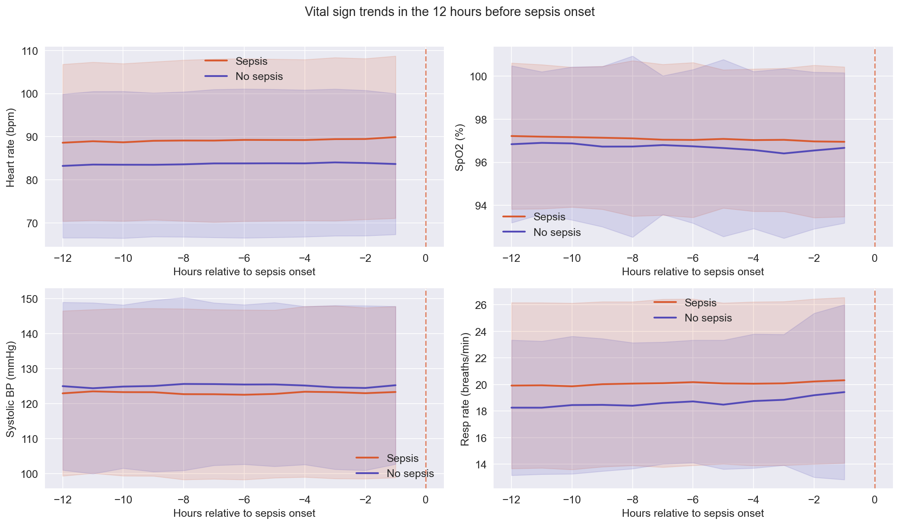
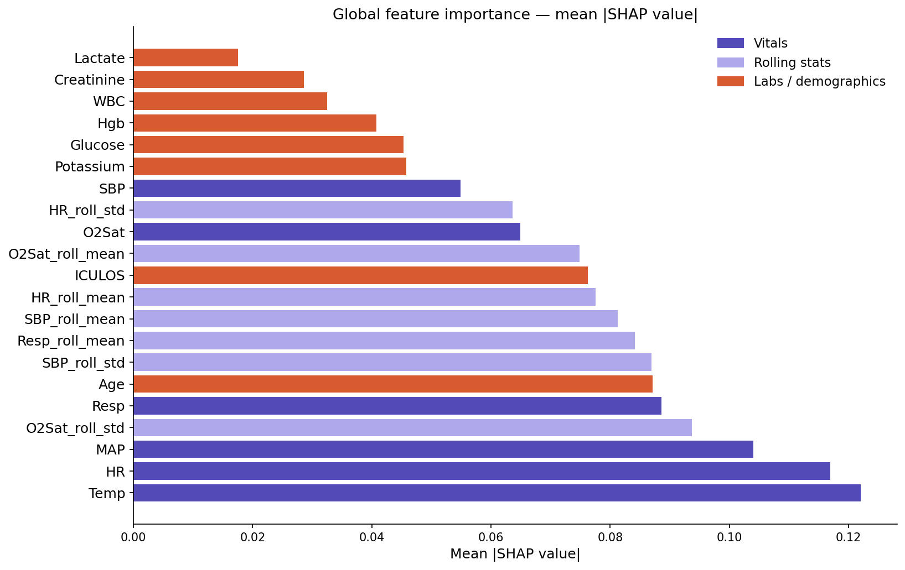
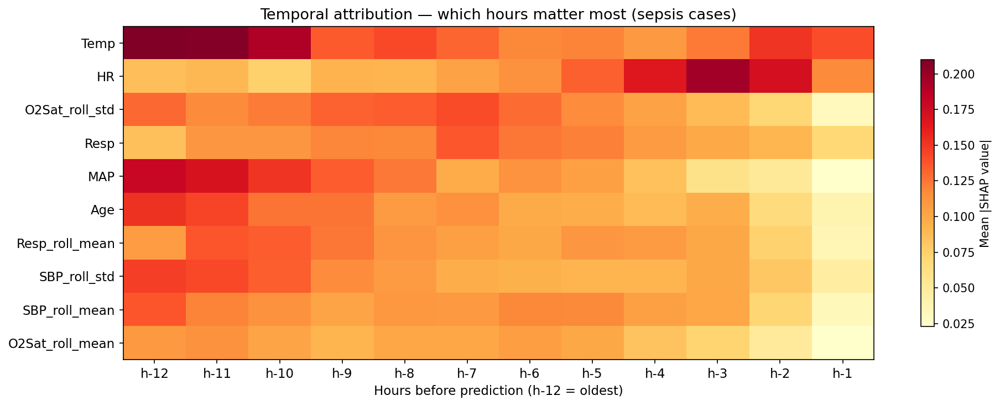

# Early Sepsis Detection using Deep Learning

A clinical decision-support system that predicts sepsis onset up to
6 hours in advance from ICU patient vitals and lab trends,
with full model explainability via SHAP.

**AUROC: 0.95 | AUPRC: 0.38 | Dataset: PhysioNet 2019 (40,336 patients)**

---

## How it works

The model ingests a 12-hour window of patient vitals (HR, SpO2,
temperature, blood pressure, respiratory rate) and predicts whether
sepsis will onset in the next 6 hours. An LSTM with temporal attention
captures deterioration patterns invisible to static models.
SHAP values explain every prediction at the feature level.

## Architecture

- Model: 2-layer LSTM with temporal attention (60K parameters)
- Input: (batch, 12 timesteps, 21 features)
- Output: sepsis probability (0-1)
- Loss: BCEWithLogitsLoss with pos_weight=46.6 (handles 2.1% prevalence)
- Training: 27 epochs, early stopping, gradient clipping

## Results

| Model               | AUROC  | AUPRC  |
|---------------------|--------|--------|
| Logistic Regression | -      | -      |
| Random Forest       | -      | -      |
| LSTM (ours)         | 0.9539 | 0.3810 |

## Key plots

### Vital sign deterioration before sepsis onset


### SHAP global feature importance


### Temporal attribution heatmap


## Project structure

```
sepsis-detection/
├── src/
│   ├── model.py           # LSTM architecture
│   ├── dataset.py         # PyTorch Dataset
│   ├── train.py           # Training loop
│   ├── evaluate.py        # AUROC, PR curve, confusion matrix
│   ├── shap_explain.py    # SHAP value computation
│   ├── shap_plots.py      # Explainability plots
│   └── app.py             # Flask dashboard
├── notebooks/             # EDA and all plots
├── data/                  # Processed data (not committed)
├── models/                # Trained weights (not committed)
└── requirements.txt
```

## How to run locally

```bash
git clone https://github.com/Fighter-web-debug/sepsis-detection.git
cd sepsis-detection
pip install -r requirements.txt
python src/app.py
# Open http://localhost:5000
```

## Tech stack

Python 3.10 · PyTorch · SHAP · scikit-learn · Flask · pandas · numpy

## Dataset

PhysioNet Computing in Cardiology Challenge 2019.
40,336 ICU patients, hourly vitals and labs, Sepsis-3 labels.
https://physionet.org/content/challenge-2019/

## Disclaimer

This project is for academic research and demonstration purposes only.
Not validated for clinical use.